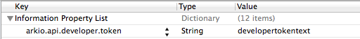

Arkio for Data.com
===========================
Arkio is an Objective-C client library for [Data.com](http://data.com).

<table width="100%" border=0>
	<tr>
		<td width="50%">1. <a href="#features">Features</a></td><td>5. <a href="#quickstart">Coding Quick Start</a></td>
	</tr>
	<tr>
		<td>2. <a href="#overview">API Overview</a></td><td>6. <a href="#unittests">Unit Tests</a></td>
	</tr>
	<tr>
		<td>3. <a href="#installation">Installation</a></td><td>7. <a href="#referencedocs">Reference Documentation</a></td>
	</tr>
	<tr>
		<td>4. <a href="#configuration">Configuration</a></td><td>8. <a href="#contact">Contact</a></td>
	</tr>

</table>

##<a name="features">Features</a>
- Full implementation of the Data.com Connect API. ([PDF](http://www.data.com/export/sites/data/common/assets/pdf/DS_Datadotcom_Connect_API_Docs.pdf)) 
- XCText unit test suite.
- CocoaPods integration.
- Complete AppleDocs with a build to install the docset in Xcode.
- Built on top of AFNetworking 2.0.

##<a name="overview">API Overview</a>
Full implementation of the Data.com Connect API means that you are able to do the following with Arkio:

- Search for Contacts.
- Purchase and download Contacts.
- Retrieve a Company's Contact Count Statistics.
- Retrieve a User's point balance.


##<a name="installation">Installation</a>
Arkio depends on CocoaPods in order to build successfully. Installation via CocoaPods is the only recommended way of integrating Arkio with your project. Why? Arkio depends on AFNetworking, and that is most easily available via CocoaPods. 

###CocoaPods 
Simply add the following line to your project's [Podfile](http://docs.cocoapods.org/podfile.html):

```
pod 'Arkio'
```
then, at the command line, from the same directory as your Podfile, run
 
```
pod install
```

Bear in mind that you will not get the unit test suite or the ability to install the AppleDoc docset locally if simply integrating Arkio with your project as explained above. 

###Unit Tests & the Docset

If you would like to install the included AppleDocs docset locally so the docset appears in the Xcode Documentation Viewer, or view and run the XCTest unit test suite you will need to clone the repo from GitHub to your local machine. You will need to run the CocoaPods command `pod install` in the root directory of the repo before building the "*Install AppleDocs*" target for the project. By default, the docset is installed to the *"~/Library/Developer/Shared/Documentation/DocSets"* location with the package name of "*com.alienhitcher.Arkio.docset*".


##<a name="configuration">Configuration</a>
To interface successfully with the Data.com API you will need a Developer Token/Key. The easiet way to configure Arkio is to add your developer token to you app's Info.plist file as the value for the key "*arkio.api.developer.token*", as below:



This allows `ARKSession` instances to pick up the value automatically. Alternately, you can set the token value directly on the session as below:

```
[arkSession setAPIDeveloperToken:@"developertokentext"];
```

##<a name="quickstart">Coding Quick Start</a>
After <a href="#installation">installation</a> and <a href="#configuration">configuration</a>, import the library header file somewhere sensible in your code:

```
#import "Arkio.h"
```
Then, initialize an `ARKSession` with a valid Data.com username and password, and use the methods on the session to interface with the API.

```objective-c

    ARKSession *session = [[ARKSession alloc] initWithUsername:@"me@example.com" 
    												  password:@"foobar"];
    												  
    [session userInformation:^(long points, ARKError *error) {
        
        if (!error) {
            NSLog(@"points = %ld ", points);
        }
        else {
            // we receive an application error message from Data.com
            NSLog(@"ark error: %@", error);
        }
    }
                     failure:^(NSError *error) {
                         // an unexpected HTTP network error occurred
                         NSLog(@"failed with network error: %@", error);
                     }
    ];

```

##<a name="unittests">Unit Tests</a>
Cloning the repo from GitHub will give you access to the XCTest unit tests. They live in the 
**ArkioTests** folder, and are a good place to find working examples of using Arkio. 

###Configure
The tests require 3 configuration settings before they'll run against a Data.com API endpoint. Navigate to the "ArkioTests/Supporting Files" folder and add values for the following keys in the ["*ArkioTests-Info.plist*"](ArkioTests/ArkioTests-Info.plist) file:

- arkio.api.developer.token
- arkio.account.username
- arkio.account.password

Parameters for the API calls made in the unit tests are stored in the supporting file named "*ArkioTestData.plist*".

###Build
You will need to run the CocoaPods command `pod install` in the root directory of the repo before building for testing with ⇧⌘U. 

##<a name="referencedocs">Reference Documentation</a>

- The [class reference documentation](http://cocoadocs.org/docsets/Arkio/) can be found on Cocoadocs.org.
- Official Data.com Connect API Documentation ([PDF](http://www.data.com/export/sites/data/common/assets/pdf/DS_Datadotcom_Connect_API_Docs.pdf)) from the Data.com [Connect Developer Program](http://www.data.com/data-resources/connect-developer/index.jsp).

##<a name="contact">Contact</a>
Arkio is maintained by [Ray Scott](https://github.com/rayascott) ([@rayascott](http://www.twitter.com/rayascott)).

##<a name="license">License</a>
Arkio is available under the MIT license. For more information, see the included [LICENSE](./LICENSE) file.
